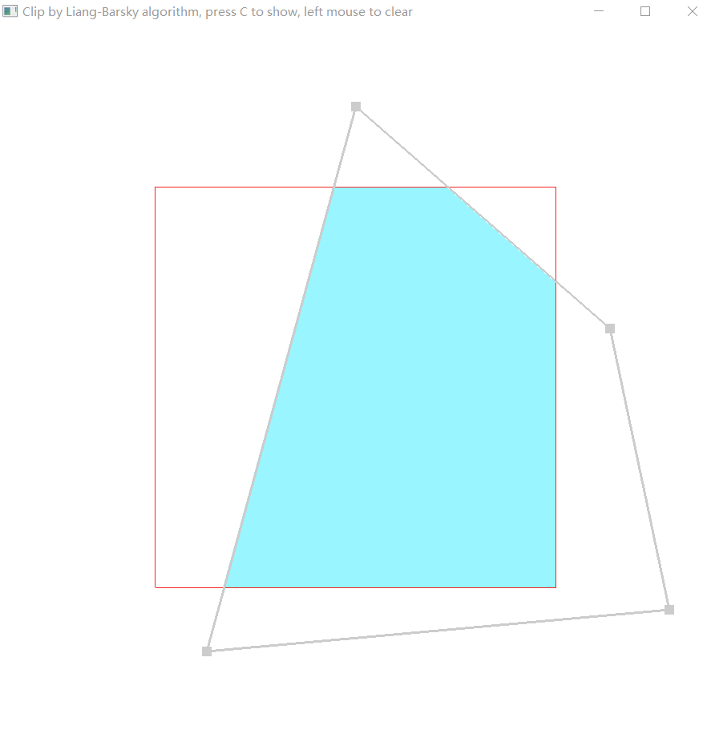

# CG-Clip
*author: 刘寅辰 &emsp;Ag2S@CRAFTSTARCN*  
Lab3 Clipping  
此项目已上传github  
地址：https://github.com/CRAFTSTARCN/CG-Clip

## 关于行数！
**src、headers中的头文件和实现，以及main文件为工程中代码**，其它为第三方库  

下列为自己写的代码行数统计：  
headers:  
&emsp;Clipper.h 41  
&emsp;Component.h 34  
&emsp;EdgeAndPoint.h 28  
&emsp;Exception.hpp 76  
&emsp;Gizmos.h 24  
&emsp;init.h 32  
&emsp;InputHandler.h 70  
&emsp;LineWidthComp.h 19  
&emsp;Logger.h 33  
&emsp;Mesh.h 60  
&emsp;PixSizeComp.h 19  
&emsp;PolygenController.h 40  
&emsp;RenderableObject.h 65  
&emsp;ScanLineAlgo.h 35  
&emsp;SimpleShaderCompiler.h 19  
&emsp;Window.h 38  

src:  
&emsp;Clipper.cpp 210  
&emsp;Component.cpp 39  
&emsp;DrawConfig.cpp 28  
&emsp;Gizmos.cpp 33  
&emsp;InputHandler.cpp 171  
&emsp;Logger.cpp 25  
&emsp;Mesh.cpp 218  
&emsp;PolygenController.cpp 129  
&emsp;RenderableObject.cpp 130  
&emsp;ScanLineAlgo.cpp 107  
&emsp;SimpleShaderCompiler.cpp 58  
&emsp;Window.cpp 134  
&emsp;main.cpp 12  

**total : 1927 lines**  

## 第三方用库：
```glfw```：opengl 库   include/GLFW lib/  
```glad```：用于快速调用glfw函数 include/glad include/KHR  
```glm```：opengl数学库 include/glm   
（这些库在文件中未提交） 

## 关于项目

是我计算机图形学的某个实验    
功能：实时多边形裁剪  
使用：  
按下C开始工作，裁剪多边形并填充，再次按下停止工作  
按下鼠标右键清空填充情况，并停止工作  
鼠标左键拖动控制点进行控制，在边上点击可以新增控制点  
鼠标停留于控制点上，点击D可以删除控制点（至少保留3点）  
